# 🏦 Multi-Currency Wallet Platform — Architecture Diagrams

> All diagrams are written in Mermaid syntax. Render with any Mermaid-compatible viewer (GitHub, VS Code Mermaid plugin, mermaid.live).

---

## Diagram 1: High-Level System Architecture

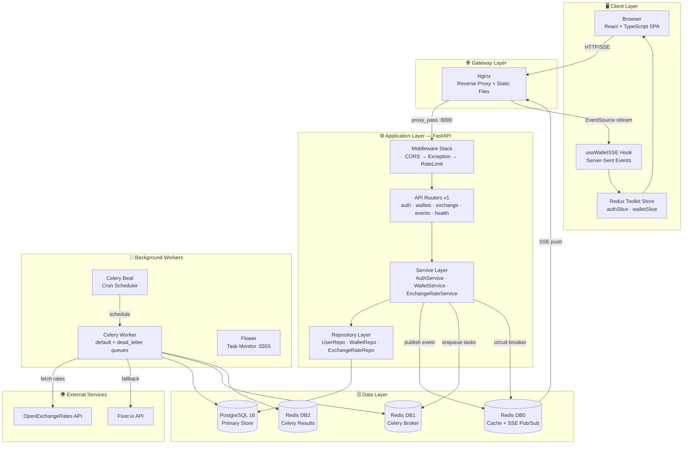

---

## Diagram 2: Layered / Clean Architecture

```mermaid
graph TB
    subgraph PRESENTATION["Presentation Layer — app/api/v1/endpoints/"]
        AUTH_EP["auth.py\nPOST /auth/signup\nPOST /auth/login\nPOST /auth/refresh"]
        WALLET_EP["wallets.py\nGET/POST /wallets\nPOST /wallets/transfer\nGET /wallets/{id}/transactions"]
        EXCHANGE_EP["exchange_rates.py\nGET /exchange-rates"]
        EVENTS_EP["events.py\nGET /events/stream"]
        HEALTH_EP["health.py\nGET /health"]
    end

    subgraph SERVICE["Service Layer — app/services/"]
        AUTH_SVC["AuthService\n• signup / login\n• JWT generation\n• token refresh & rotation"]
        WALLET_SVC["WalletService\n• create wallet\n• credit / debit\n• transfer (atomic)\n• transaction history"]
        EXCHANGE_SVC["ExchangeRateService\n• get_rate()\n• refresh_all_rates()\n• cross-rate calculation"]
    end

    subgraph REPOSITORY["Repository Layer — app/repositories/"]
        USER_REPO["UserRepository\n• get_by_email()\n• create()"]
        WALLET_REPO["WalletRepository\n• get_by_id_with_lock() ← SELECT FOR UPDATE\n• update_balance()"]
        TXN_REPO["TransactionRepository\n• create_transaction()\n• get_wallet_transactions()"]
        RATE_REPO["ExchangeRateRepository\n• upsert_rate()\n• get_rate()"]
        IDEMPOTENCY_REPO["IdempotencyRepository\n• get_by_key()\n• create()"]
    end

    subgraph MODEL["Domain / Model Layer — app/models/"]
        USER_MODEL["User\nemail · hashed_password\ndefault_currency · role"]
        WALLET_MODEL["Wallet\nowner_id · currency\nbalance (Numeric 18,8)\nstatus"]
        TXN_MODEL["Transaction\nwallet_id · type · amount\nbalance_before · balance_after\nreference · metadata_json"]
        TRANSFER_MODEL["Transfer\nsender_wallet_id\nrecipient_wallet_id\nexchange_rate · converted_amount\nidempotency_key"]
        RATE_MODEL["ExchangeRate\nbase_currency · target_currency\nrate · provider"]
        AUDIT_MODEL["AuditLog\naction · resource_type\nip_address · details"]
        IDEMPOTENCY_MODEL["IdempotencyKey\nkey · user_id · request_path\nresponse_status · response_body"]
    end

    PRESENTATION --> SERVICE
    SERVICE --> REPOSITORY
    REPOSITORY --> MODEL

    style PRESENTATION fill:#1a365d,color:#fff
    style SERVICE fill:#2d6a4f,color:#fff
    style REPOSITORY fill:#7b2d00,color:#fff
    style MODEL fill:#3d1a6e,color:#fff
```

---

## Diagram 3: Design Patterns Map

```mermaid
mindmap
  root((Design Patterns))
    Creational
      Factory Pattern
        create_application() in main.py
        Testable app instances
        No module-level side effects
      Singleton Pattern
        lru_cache on get_settings()
        Redis client singleton
        Parse env once at startup
    Structural
      Repository Pattern
        BaseRepository generic class
        WalletRepository
        UserRepository
        ExchangeRateRepository
        Decouples SQL from business logic
      Adapter Pattern
        ExchangeRateProvider ABC
        OpenExchangeAdapter
        FixerAdapter
        MockExchangeAdapter
        Swap providers with zero service changes
    Behavioral
      Circuit Breaker
        Redis-backed shared state
        CLOSED → OPEN → HALF-OPEN → CLOSED
        Fail fast on provider downtime
      Strategy Pattern
        Exchange rate resolution
        Direct → Inverse → Cross-via-USD
      Observer Pattern
        Redis Pub/Sub
        SSE endpoint subscribes
        Browser EventSource receives
        Redux dispatches updates
      Idempotency Pattern
        Transfer deduplication
        IdempotencyKey model
        Exact response replay
    Concurrency
      Pessimistic Locking
        SELECT FOR UPDATE on wallets
        Sorted UUID lock order
        Deadlock prevention
      Deadlock Prevention
        Lock lower UUID first always
        Consistent lock ordering
      Dead Letter Queue
        MaxRetriesExceeded handler
        Ops inspection and replay
```

---

## Diagram 4: Database Entity Relationship Diagram

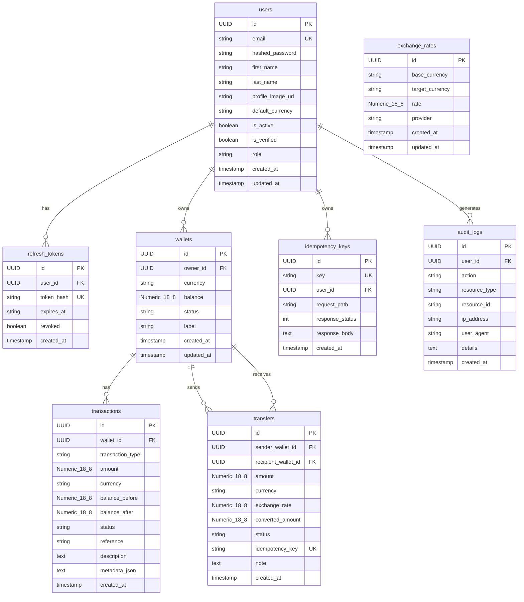

---

## Diagram 5: Authentication & Token Flow

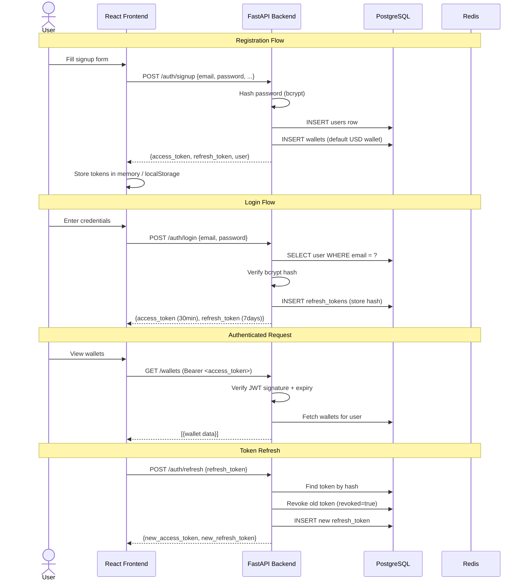

---

## Diagram 6: Transfer / Payment Flow

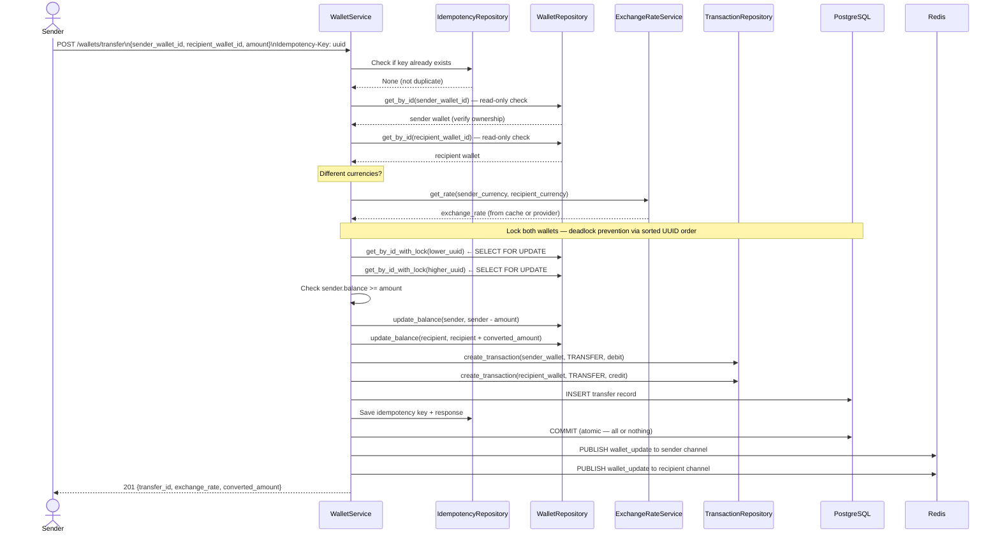

---

## Diagram 7: Circuit Breaker State Machine

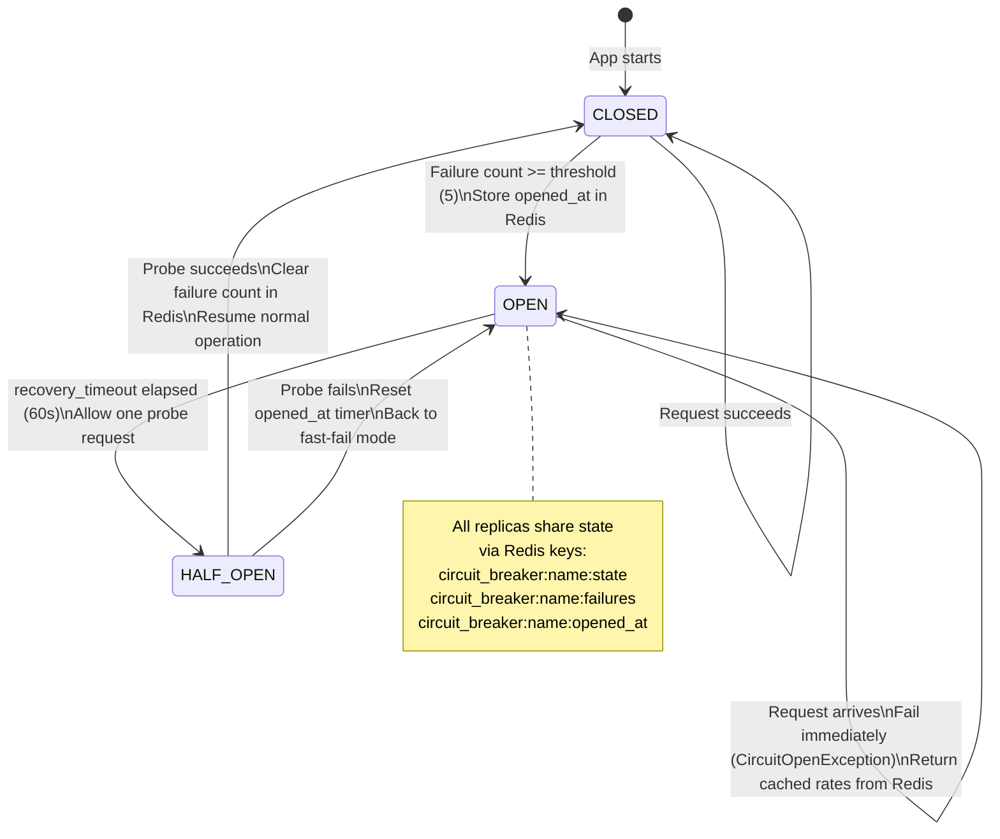

---

## Diagram 8: Real-Time SSE Architecture

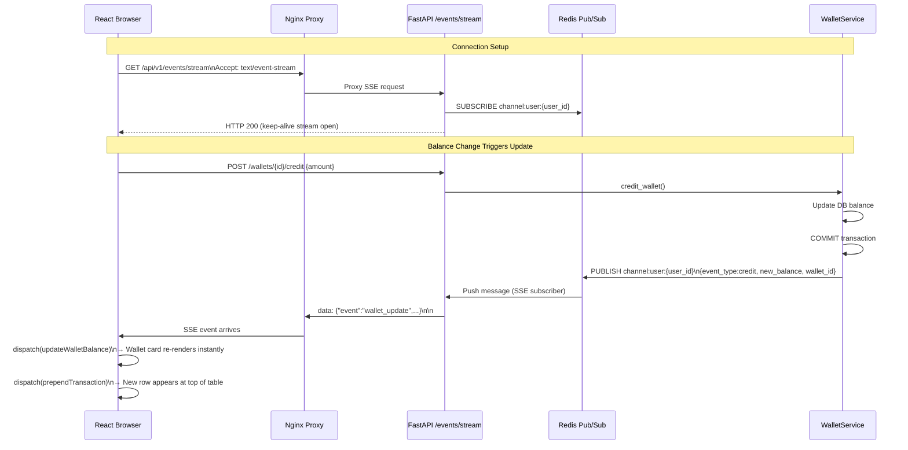

---

## Diagram 9: Docker Infrastructure

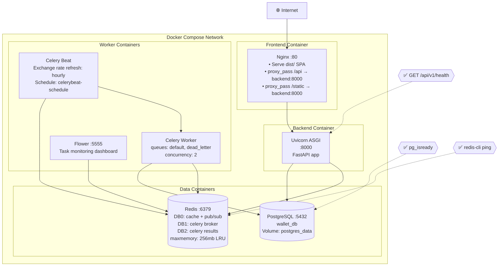

---

## Diagram 10: Async Task Pipeline (Celery)

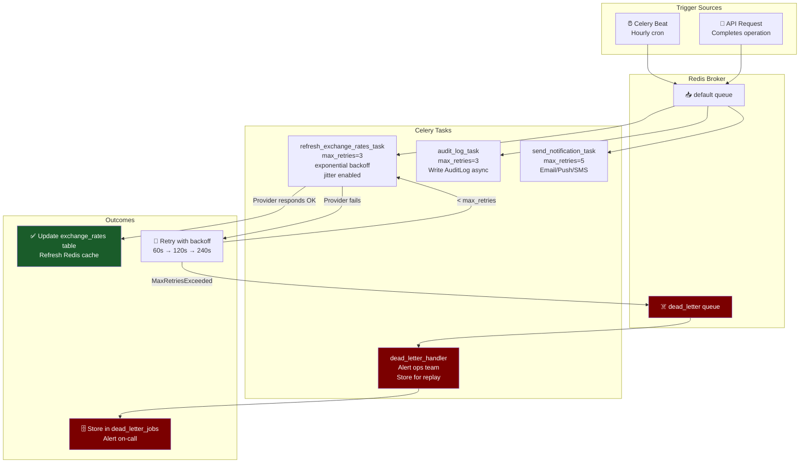

---

## Diagram 11: Middleware Execution Order

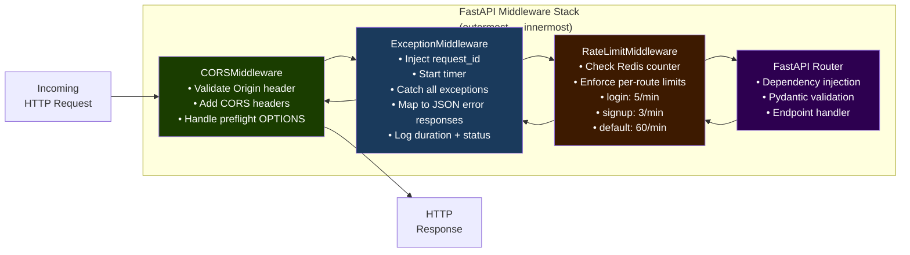

---

## Diagram 12: Scalability Architecture (Design Note — 500k Users / 100 TPS)

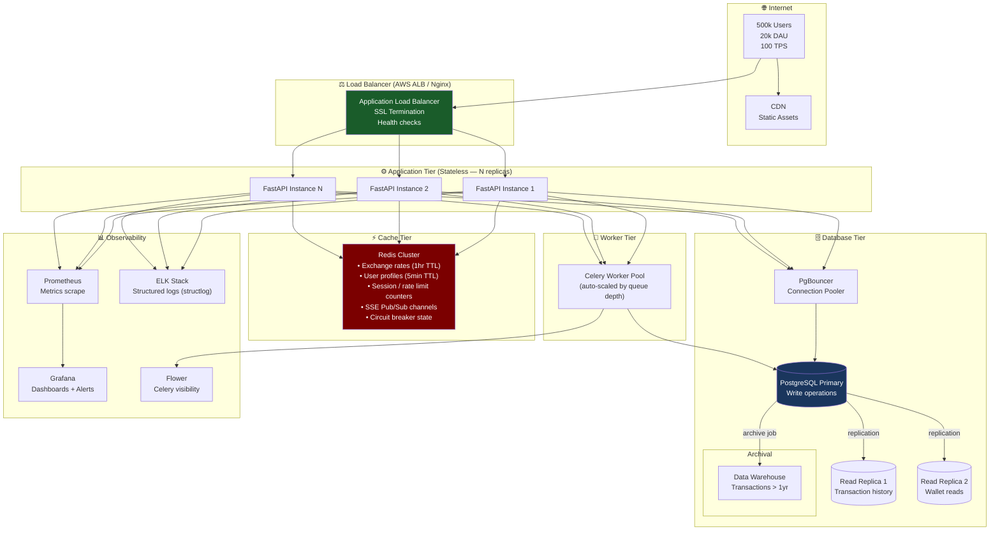

---

*Diagrams version: 1.0.0 | Generated: 2026-07-12*  
*Render with: [mermaid.live](https://mermaid.live) | GitHub markdown | VS Code Mermaid Preview extension*
